# Conduit とは

Conduit は Medium.com のクローンの記事投稿サイトです。
その似た機能のサイトを Rails と Next.js で実装します。

# デプロイ先
https://next-js-rails-api-conduit.vercel.app/
Verselを使っています

# アーキテクチャ図

# 使用技術

- バックエンド
  - Ruby 3.2.2
  - Rails 7.1.2
- フロントエンド
  - React 18.2.0
  - Next.js 14.1.0
- DB
  - sqlite

# 実行方法(現在デプロイ中です)

Rails 側で
`rails server -p 3001`
実行し APP サーバーを localhost:3001
で立てる。  
[Rails は別リポジトリ参照](https://github.com/Taku1103/API_Realworld_Quest)

Next.js 側で
`npm run dev`
を実行し Web サーバーを localhost:3000 で立てる。

# 実装したもの

- articles(投稿記事)
  - 作成/一覧表示/詳細表示/更新/削除 の CRUD 処理
  - users とのリレーション(対一)
- users
  - 登録 処理
  - secure なパスワード
  - articles とのリレーション(対多)
- 認証
  - セッションストレージを用いた user のログイン/ログアウト処理
- その他
  - ヘッダーの ログイン時で表示切替
  - セッションストレージを用いたログインユーザー情報の描画
  - articles と users テーブル結合して記事投稿者の username を表示
